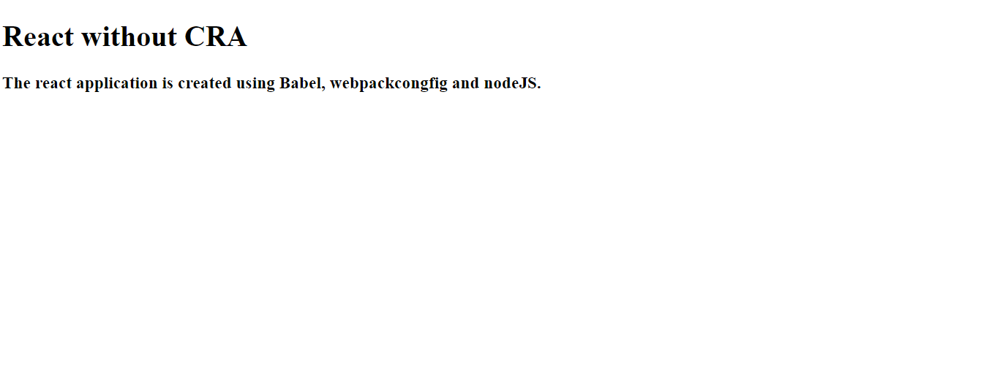

# React-without-CRA

This repo consists of all the necessary configuration to set up a react application without CRA.

### To run the application, use the command npm start.

## File Format

- package.json: Contains all the necessary configuration for modules in the folder.

- webpack.config.js: Contains all the necessary configuration of the webpack such as port, entry point file, hot reload, etc. Webpack is the bundler for modern javascript application and it bundles everything into one javascript file.

- babelrc: Configuration for the babel. It helps older browsers to understand the newer javascript.
